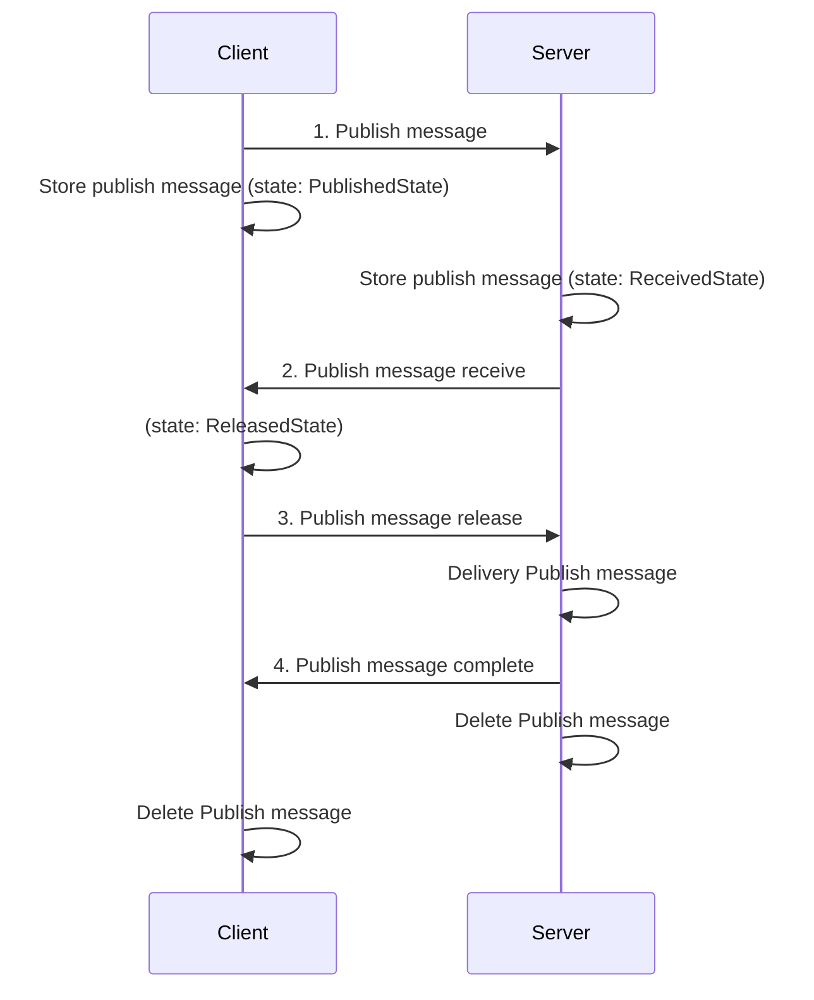

Message Control
====

#### Qos2

```mermaid
sequenceDiagram
participant C as Client
participant S as Server
C->>S: 1. Publish message
C->>C: Store publish message (state: PublishedState)
S->>S: Store publish message (state: ReceivedState)
S->>C: 2. Publish message receive
C->>C: (state: ReleasedState) 
C->>S: 3. Publish message release
S->>S: Delivery Publish message
S->>C: 4. Publish message complete
S->>S: Delete Publish message
C->>C: Delete Publish message
```

